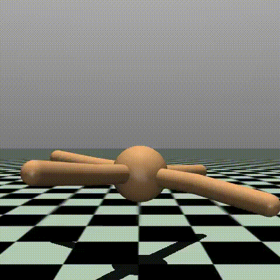

### Gymnasium RL Agent Trainer - A Modular Framework for Algorithm Benchmarking, Hyperparameter Optimization, and Performance Evaluation in MuJoCo Environments

Per leggere README.md in Italiano, clicca [quì](README.md).

## Table of Contents  
1. [Project Description](#1-project-description)
2. [Environment Setup](#2-environment-setup)
3. [Repository Structure](#3-repository-structure)
4. [Supported Agents](#4-supported-agents)
5. [Implemented Algorithms](#5-implemented-algorithms)
6. [Project Usage](#6-project-usage)
    - 6.1 [Parameter Configuration](#61-parameter-configuration)
    - 6.2 [Running Hyperparameter Tuning](#62-running-hyperparameter-tuning)
    - 6.3 [Running Training](#63-running-training)
    - 6.4 [Agent Evaluation and Graphs Presentation](#64-agent-evaluation-and-graphs-presentation)
    - 6.5 [Using Pre-Trained Models](#65-using-pre-trained-models)
7. [Training Specifications of Pre-Trained Models](#7-training-specifications-of-pre-trained-models)
8. [Results and Conclusions](#8-results-and-conclusions)

### 1. Project Description
This project is dedicated to the implementation and evaluation of several advanced Reinforcement Learning (RL) algorithms for training autonomous agents in a variety of Gymnasium environments, such as **HalfCheetah-v5**, **Ant-v5**, **Humanoid-v5** and **Hopper-v5**. The main goal is to provide a flexible platform to experiment with multiple RL algorithms, compare their performance and leverage pre-trained models for a quick start.

The project supports the following RL algorithms: **Proximal Policy Optimization (PPO)**, **Soft Actor-Critic (SAC)**, **Actor-Critic (A2C)**, **Deep Q-Network (DQN)**, **Twin Delayed Deep Deterministic Policy Gradient (TD3)** and a **random policy** as a baseline.

A key feature of this project is the ability for the user to **specify various parameters**, including the folder paths for saving models and results, whether or not to perform hyperparameter tuning, and whether to evaluate the trained agents by measuring their performance and comparing them using graphs. Additionally, the project provides **pre-trained models** for some algorithms and environments, allowing users to quickly test performance without having to go through the entire hyperparameter tuning and training process. Finally, **comparison graphs** are generated to visualize the performance of different trained or pre-trained models, making it easier to analyze and identify the most effective algorithms for each environment.

### 2. Environment Setup
Before running the code, make sure you are using **Python 3.10.\*** version. It is important to properly configure the environment by following these steps:
1. **Create a Virtual Environment**:
* Open a terminal or command prompt.
* Run the command: `python -m venv venv`
2. **Activate the Virtual Environment**:
* On Windows: `.\venv\Scripts\activate`
* On Unix or MacOS: `source ./venv/bin/activate` or `source ./venv/Scripts/activate`
3. **(Optional) Deactivate the Virtual Environment**:
* Run the command: `deactivate`
4. **Install Dependencies**:
* After cloning the project and activating the virtual environment, install the required dependencies using: `pip install -r requirements.txt`. This command will download all the necessary non-standard modules.
5. **Upgrade pip (if necessary)**:
* If your pip version is not up to date, run: `pip install --upgrade pip`.

### 3. Repository Structure
The repository is organized for easy navigation and file management. It is presented below:

```
├── results/               # Folder for results saving
│   ├── evaluation/        # Folder for saving agent performances in specified environments
│   │   ├── metrics_Ant-v5.json
│   │   ├── metrics_Hopper-v5.json
│   │   └── ...
│   ├── hyperparameters/   # Folder for saving the best hyperparameters for environment-specific models
│   │   ├── A2C_Ant-v5_best_params.json
│   │   ├── DQN_Andt-v5_best_params.json
│   │   └── ...
│   ├── model/             # Folder for saving pre-trained models
│   │   ├── A2C_Ant-v5.zip
│   │   ├── DQN_Ant-v5.zip
│   │   ├── DQN_Hopper-v5.zip
│   │   └── ...
│   ├── plots/             # Folder for saving graphs
│   │   ├── Comparison of Algorithms rewards during 10 episodes for Ant-v5.png
│   │   ├── Rewards during episodes for Ant-v5.png
│   │   └── ...
│   └── videos/            # Folder for saving videos useful for viewing the model in progress
│
├── monitoring/            # Folder for monitoring the environment during training
│   
├── Vec_normalization/     # Folder for saving normalization statistics of an environment
├── argumentParser.py
├── environments.py
├── main.py                # File to execute for program execution
├── model.py
├── plotter.py
├── requirements.txt
└── README.md
```
### 4. Supported Agents
This project supports training and evaluation of the following agents (listed in order of complexity) provided by the Gymnasium environment:
* **Hopper-v5**: 2D monopod agent designed to test balance and jumping algorithms. The goal is to maintain a rhythmic forward swing without overloading the joints, with observations focused on torso angle and linear/angular velocities.
* **HalfCheetah-v5**: MuJoCo-based simulation environment that models a 2D cheetah-like agent. The goal is to optimize locomotion to achieve maximum forward velocity, controlling continuous torques on 6 joints. The v5 version introduces more stable physics and more detailed observations than previous iterations.
* **Ant-v5**: 3D quadruped agent that requires coordination of 8 joints for efficient locomotion. The main challenge is to balance dynamic stability and energy consumption, with observations that include kinetic and ground contact data.
* **Humanoid-v5**: Advanced environment for controlling a biped humanoid with 21 degrees of freedom. The agent must learn walking strategies while avoiding falls, managing complex physical interactions between limbs and torso. The v5 version improves collision handling and reduces simulation artifacts.

All environments use MuJoCo 3.0 and offer continuous action spaces, making them ideal for testing reinforcement learning algorithms on high-dimensional motor control problems.

### 5. Implemented Algorithms
This project includes implementations of the following Reinforcement Learning algorithms:
* **Proximal Policy Optimization (PPO)**: A policy gradient method that uses a surrogate objective function to allow mini-batch updates over multiple epochs. PPO offers a good balance between performance and ease of implementation.
* **Soft Actor-Critic (SAC)**: An off-policy actor-critic algorithm that aims to maximize both the expected reward and the entropy of the policy, encouraging exploration and robustness.
* **Actor-Critic (A2C)**: A variant of actor-critic that performs parallel updates on multiple agents (or copies of the environment) to stabilize learning.
* **Deep Q-Network (DQN)**: A value-based algorithm that uses a deep neural network to approximate the Q-function, learning the best action to take in each discrete state. Working in a discrete state, when this algorithm is specified the program proceeds to a discretization of the action space.
* **Twin Delayed Deep Deterministic Policy Gradient (TD3)**: An off-policy actor-critic algorithm that addresses the problem of overestimation of the Q function using two critics and delayed policy updates.
* **Random Policy**: A basic policy that selects actions randomly, useful for comparing the performance of learning algorithms.

### 6. Project Usage

#### 6.1 Parameter Configuration
The user will be able to configure various aspects of the project execution via command line arguments. The configurable parameters can be viewed by executing the following code
```bash
python main.py --help
```
For clarity they are also reported below:
* ```--model_type```: Model type. The following parameters are accepted: ```PPO```, ```DQN```, ```A2C```, ```TD3```, ```SAC```, ```random```. If not specified the devault parameter is ```PPO```
* ```--env_id```: ID of the gymnasium environment. The parameters accepted are ```Humanoid-v5```, ```HalfCheetah-v5```, ```Hopper-v5```, ```Ant-v5```. Default ```Ant-v5```
* ```--save_path```: Path to save the pre-trained models. Warning, if you do not want to overwrite the pre-trained models this parameter must be specified. Default ```./results/model/```
* ```--save_eval_path```: Path to save the evaluation metrics. Warning, if you do not want to overwrite the metrics of the pre-trained models this parameter must be changed. Default ```./results/evaluation```
* ```--total_timesteps```: Number of time steps to train the model. Default ```500_000```
* ```--device```: Device for running the model. For models not based on neural architectures it is preferable to specify the parameter ```cpu``` for faster execution. For execution on a graphics card specify ```cuda```. Default ```cuda```
* ```--tunehp```: If specified, hyperparameter tuning is performed
* ```--no_train```: If specified, no training is performed
* ```--n_envs```: Number of parallel environments initialized. Default 1
* ```--seed```: Random seed for reproducibility of results. Default 42
* ```--env_monitor_dir```: Path to the directory to save environment monitoring data. Default ```./monitoring/```
* ```--no_record_video```: If specified, no videos are rendered
* ```--evaluate_model```: If specified, model evaluation is performed. For completeness of comparison it is preferable to specify it only when all models have been trained for the specified environment
* ```--n_eval_episode```: Number of episodes to run for model evaluation. Default 10
* ```--comparison_plot```: If specified, comparisons between models are plotted. The comparison requires the previous evaluation of the models

#### 6.2 Running Hyperparameter Tuning
The user can specify whether to perform hyperparameter tuning. Some hyperparameters have already been calculated and are contained in the directory ```./results/hyperparameters/```. To execute only the hyperparameter tuning phase, the user simply needs to execute the following code:
```bash
pyton main.py --tunehp --no_train --no_record_video --model_type <preferred_model_type> --env_id <preferred_environments>
```

#### 6.3 Running Training
Once the hyperparameters have been calculated and saved, the user can run the training process for the specified agent and algorithm. The script will take care of creating the environment, initializing the agent with the selected algorithm and starting the training cycle. It is preferable that the user chooses a higher number of time steps than the default one, especially for more complex agents like Ant-v5 or Humanoid-v5.

To run the training, the user can execute the following code
```bash
python main.py --no_record_video --env_id <preferred_environment> --model_type <preferred_model_type> --total_timesteps <number_of_timesteps>
```

#### 6.4 Agent Evaluation and Graphs Presentation
After training (or loading a pre-trained model), the user can run an evaluation phase. For the evaluation of the models, it is recommended to specify the environment in which to evaluate them. During the evaluation, the trained agent will interact with the environment for a certain number of episodes that can be specified by the user, and performance metrics will be calculated to quantify the effectiveness of the learning. A comparison with a random policy will be made to highlight the improvement achieved.

To run the evaluation you can run the following code
```bash
python main.py --no_train --evaluate_model --env_id <preferred_evaluating_environment_id>
```
After the evaluation phase you can display the comparison plots by integrating the previous code with `--comparison_plot` or by running the following code
```bash
python main.py --no_train --no_record_video --comparison_plot --env_id <preferred_evaluating_environment_id>
```
The plots that are presented in this project are:
* **Average reward plots**: a boxplot of the average reward obtained by the agents in the different evaluation episodes
* **Reward progression**: a plot that shows the progression of the reward during the evaluation episodes

Note that the evaluation always includes the execution of a random policy. This favors the comparison between the models.

#### 6.5 Using Pre-Trained Models
The project will provide a selection of pre-trained models for some agents and algorithms. The user can specify not to perform the training and in this case the program will load the specified pre-trained model. In this case, if specified, it will proceed directly to the evaluation phase and generation of comparison graphs.

WARNING: some of the algorithms used in this project such as SAC or A2C may require long training times. In particular, for training the pre-trained models presented here were all trained for a total of 2000000 (2 mln) time steps and took from 1h and 20min (PPO) to 9h and 45min (SAC).

### 7. Training Specifications of Pre-Trained Models
The pre-trained models provided with this project were all trained after performing hyperparameter tuning. To compare the performance of the models, fixed the agent (parameter `--env_id`), they were all trained with the same number of time stamps. This number was decided by making a trade-off between the computational capabilities of the machine on which the training took place and the results achievable. Therefore the number of time steps for training the models based on the agent is as follows:
* `Hopper-v5`: 2000000 - two million;
* `Ant-v5`: 6000000 - six million;
* `Humanoid-v5`: 12000000 - twelve million;
Note that the DQN model is not provided for the `Humanoid-v5` agent due to technical limitations of the training distributor.

### 8. Results and Conclusions
Results and performance analysis are contained in the file [results.md](./results/results.md).

<table>
  <tr>
    <td align="center">
      
      <br>
    </td>
    <td align="center">
      
      <br>
    </td>
    <td align="center">
      
      <br>
    </td>
  </tr>
</table>